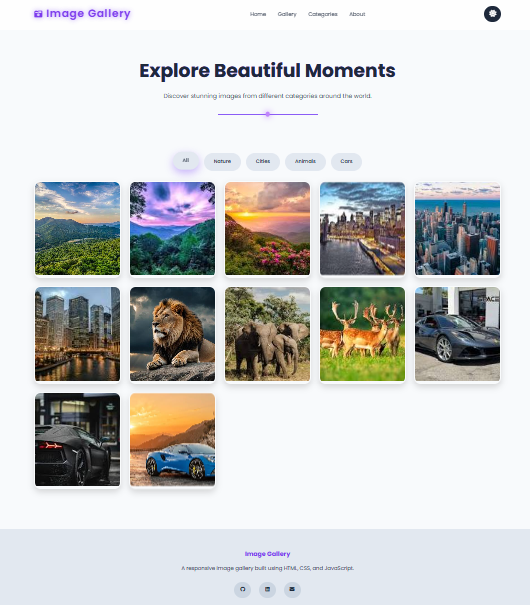

# 📷 Responsive Image Gallery

A modern responsive image gallery built with HTML, CSS, and JavaScript during my CodeAlpha Frontend Development Internship. Features include category filtering, lightbox navigation, dark/light mode, animations, and a responsive design.

The project features category filtering, a professional lightbox, dark/light theme support, smooth animations, and a fully responsive design.

---

## 🚀 Live Features

- 📱 Fully Responsive Design
- 🖼️ Interactive Image Gallery
- 🔍 Lightbox Preview
- ⬅️ Previous & Next Navigation
- ⌨️ Keyboard Navigation (Arrow Keys + ESC)
- 🏷️ Category Filtering
- 🎬 Animated Preloader
- ✨ Scroll Reveal Animations
- ⬆️ Back to Top Button
- 🌙 Dark / ☀️ Light Theme
- 💾 Theme Preference Saved with Local Storage
- 🎨 Modern Glassmorphism UI
- 🖱️ Hover Animations
- 📊 Image Counter

---

## 🛠️ Technologies Used

- HTML5
- CSS3
- JavaScript (ES6)
- Font Awesome
- Google Fonts (Poppins)

---

## 📂 Project Structure

```
Image-Gallery/
│
├── images/
│   ├── nature/
│   ├── cities/
│   ├── animals/
│   └── cars/
│
├── index.html
├── style.css
├── script.js
└── README.md
```

---

## 📸 Screenshots

### 🏠 Home Page


---

### 🔍 Lightbox

---

---

## 💻 How to Run

1. Download or clone this repository.

```
git clone https://github.com/muhammadkumail317/image-gallery.git
```

2. Open the project folder.

3. Open **index.html** in your browser.

No additional installation is required.

---

## 📚 What I Learned

During this project I practiced:

- Responsive Web Design
- CSS Grid Layout
- Flexbox
- DOM Manipulation
- Event Listeners
- JavaScript Functions
- Image Filtering
- Lightbox Implementation
- Keyboard Events
- Local Storage
- CSS Animations
- Modern UI Design

---

## 🎯 Internship Information

**Internship:** CodeAlpha Frontend Development Internship

**Task:** Responsive Image Gallery

---

## 👨‍💻 Author

**Muhammad Kumail Noor**

Frontend Development Intern at CodeAlpha

GitHub: https://github.com/muhammadkumail317

LinkedIn: https://linkedin.com/in/www.linkedin.com/in/muhammad-kumail-noor

---

## ⭐ If you like this project

If you found this project useful, consider giving it a ⭐ on GitHub.
